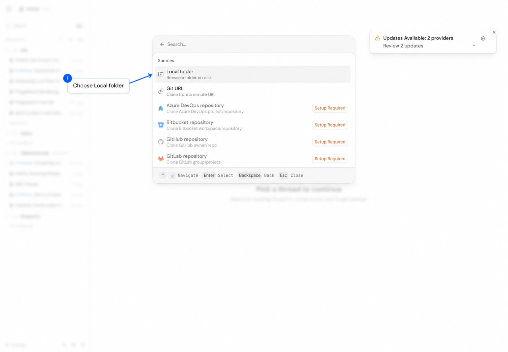
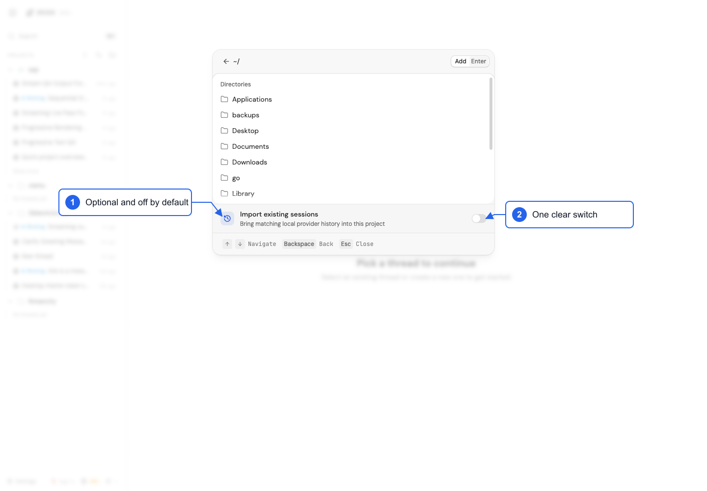
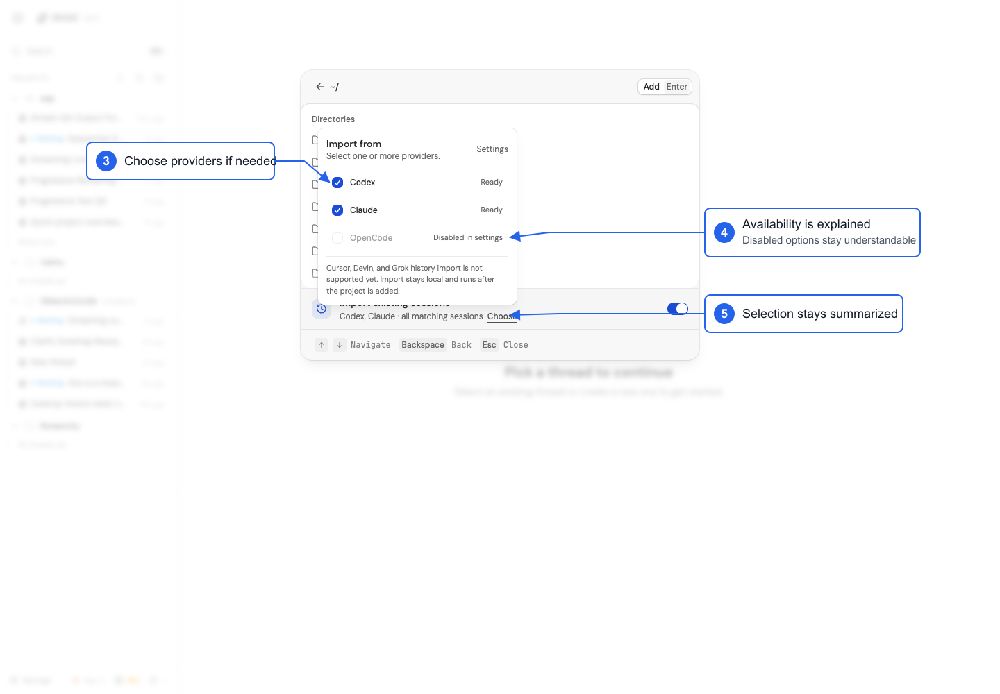
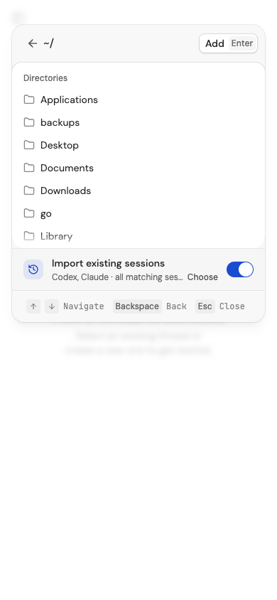

# Add Project: existing-session import walkthrough

## 1. Open the import flow

1. Select **Add project** in the Projects section.
2. Choose **Local folder**.
3. Enter or browse to the project folder.

## 2. Decide whether to import

The default experience stays simple: one optional row, off by default. Leave it off and
select **Add** for the normal project flow, or turn it on to import matching local history.

## 3. Choose providers only when needed

When import is on, **Choose** opens a small provider picker. Ready providers can be selected;
disabled providers explain why they are unavailable. The main dialog keeps only a short summary.

Select **Add** when ready. Import runs locally in the background after the project is added, and
matching sessions appear as project threads.

## Responsive verification

At a 390 px viewport, the import remains a single row, the primary controls remain reachable,
and the page has no horizontal overflow.

## Current capability

- Supported: Codex, Claude, OpenCode.
- Not yet supported: Cursor, Devin, Grok.
- Import is opt-in and only reads local provider history.
